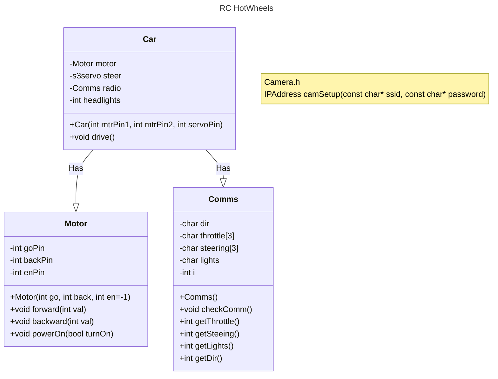
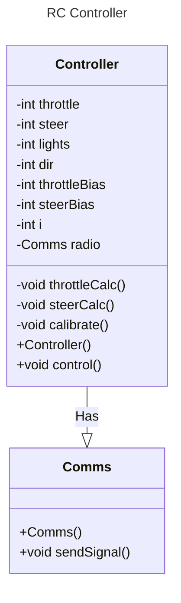

# Class Diagram

```mermaid
---
title : RC HotWheels
---
classDiagram

    class Car{
        -Motor motor
        -s3servo steer
        -Comms radio
        -int headlights
        +Car(int mtrPin1, int mtrPin2, int servoPin)
        +void drive()
    }
  
    Car --|> Motor : Has
    Car --|> Comms : Has

    class Motor{
        -int goPin
        -int backPin
        -int enPin
        +Motor(int go, int back, int en=-1)
        +void forward(int val)
        +void backward(int val)
        +void powerOn(bool turnOn)
    }

    class Comms{
        -char dir
        -char throttle[3]
        -char steering[3]
        -char lights
        -int i

        +Comms()

        +void checkComm()

        +int getThrottle()
        +int getSteeing()
        +int getLights()
        +int getDir()
    }

    

    note "Camera.h
    IPAddress camSetup(const char* ssid, const char* password)"

```

```mermaid
---
title : RC Controller
---
classDiagram

    class Controller{
        -int throttle
        -int steer
        -int lights
        -int dir
        -int throttleBias
        -int steerBias
        -int i
        -Comms radio
        -void throttleCalc()
        -void steerCalc()
        -void calibrate()

        +Controller()
        +void control()

    }
  
    Controller --|> Comms : Has

    class Comms{
        +Comms()
        +void sendSignal()
    }

```