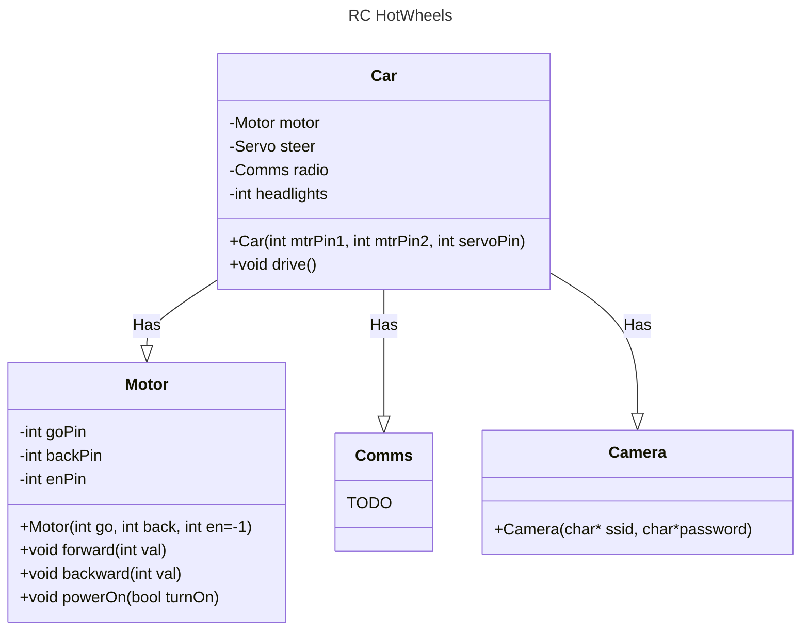

# Class Diagram

```mermaid
---
title : RC HotWheels
---
classDiagram

    class Car{
        -Motor motor
        -Servo steer
        -Comms radio
        -int headlights
        +Car(int mtrPin1, int mtrPin2, int servoPin)
        +void drive()
    }
  
    Car --|> Motor : Has
    Car --|> Comms : Has
    Car --|> Camera : Has

    class Motor{
        -int goPin
        -int backPin
        -int enPin
        +Motor(int go, int back, int en=-1)
        +void forward(int val)
        +void backward(int val)
        +void powerOn(bool turnOn)
    }

    class Camera{
        +Camera(char* ssid, char*password)
    }

    class Comms{
        TODO
    }

```
